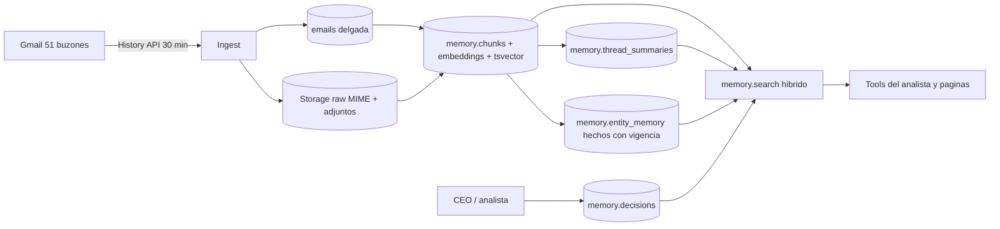
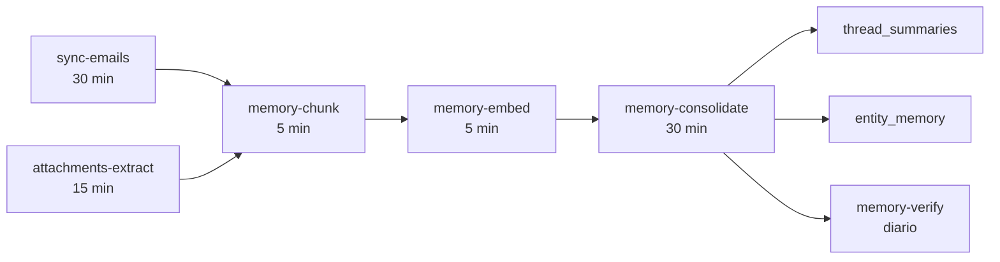

# Memoria de Quimibond — Diseño

> Documento vivo: https://claude.ai/code/artifact/5fb4b69a-569e-4a23-9efc-a891f9f03b16
> Copia en repo para referencia del código; la versión editable es la de arriba.

2026-09-16 · Jose J. Mizrahi (con Claude Code)

## Resumen ejecutivo

Se propone sacar la memoria del correo de la tabla bronze `emails` y construirla como un schema propio (`memory`) en tres capas: crudo completo, memoria consolidada y retrieval híbrido. Hoy el correo de 51 buzones (232,593 mensajes, 2.8 GB) vive en una sola tabla que mezcla ingest, vector de búsqueda y flags de proceso; el 12% de los cuerpos llega truncado, el vector solo cubre los primeros 500 caracteres de cada correo y los hechos extraídos (43k) no tienen vigencia ni conexión con las entidades canónicas de Odoo y SAT.

El diseño mantiene la ingesta actual (Gmail History API cada 30 min) pero deja de perder información en la puerta, mueve los embeddings a chunks en su propia tabla, reemplaza `facts`/`entities`/`ai_extracted_facts` por una memoria por entidad con `valid_from`/`valid_to` ligada a `canonical_*`, agrega resúmenes de hilo mantenidos y una memoria de decisiones del CEO que hoy no existe. Se ejecuta en 5 fases sin cortar el servicio: cada fase corre en paralelo a lo viejo hasta alcanzar cobertura y solo entonces se apaga lo anterior.

Repos afectados: `quimibond-intelligence` (pipelines Vercel, tools del analista, migraciones Supabase). `qb19` no cambia.

## Diagnóstico del estado actual

El correo está configurado como un pipeline de ingest funcional pero sin capa de memoria: todo lo derivado se calcula sobre la tabla bronze y se guarda en tablas aisladas entre sí. Inventario verificado en Supabase (proyecto `tozqezmivpblmcubmnpi`) y en el código de `quimibond-intelligence` el 16-sep-2026.

### Ingesta (Vercel, `src/lib/pipeline/gmail.ts` + `email-persist.ts`)

| Aspecto | Configuración actual | Consecuencia |
| --- | --- | --- |
| Acceso | Service account con delegación de dominio, scope `gmail.readonly`, 51 buzones en `GMAIL_ACCOUNTS_JSON` | Correcto, se conserva |
| Cadencia | Cron cada 30 min, History API por cuenta, cursor en `sync_state.last_history_id`; bootstrap 72 h si el historial expira | Correcto; ya protege el cursor si el insert falla |
| Cuerpo | `text/plain` preferido, fallback HTML con strip por regex, corte en 5,000 chars | 28,684 correos (12.3%) truncados; HTML y citas se pierden |
| Encabezados | Solo From, To, Subject, Date | Sin Message-ID, In-Reply-To, References, Cc, labels |
| Adjuntos | Solo metadata (nombre, mime, tamaño, attachmentId) | 72% de correos tienen adjuntos; ninguno se guarda |
| Duplicados | Upsert con `ignoreDuplicates` por `gmail_message_id` | Un correo guardado nunca se corrige ni se enriquece |
| Backfill | Cola `email_backfill_state` por cuenta, 52 filas todas `done`, 88,135 correos recuperados hasta 18-ago-2026 | Mecanismo reutilizable para re-bajar historial |

### Almacenamiento (tabla `emails`)

| Métrica | Valor |
| --- | --- |
| Correos | 232,593 (12-oct-2025 a 16-sep-2026) |
| Tamaño total | 2,802 MB |
| Heap | 390 MB |
| TOAST (body + embedding) | 1,467 MB |
| Índice HNSW `idx_emails_embedding_hnsw` | 817 MB |
| Cuerpo promedio | 1,713 chars (máx 5,000) |
| Con `embedding` | 223,198 (96%) |
| Con `kg_processed` | 101,193 (43.5%), backlog todo anterior a mayo |
| Con `company_id` | 84% |
| Con `sender_contact_id` | 79% |
| `enrichment_status = pending` | 232,269 (nunca se marca done) |
| Threads | 111,680 (70,852 `new`, 27,331 `stalled`, 13,192 `active`) |

El vector es un solo voyage-3 de 1024 dimensiones por correo, calculado sobre el texto "De | Asunto | primeros 500 chars del cuerpo". Es la única columna vector de toda la base y su índice pesa el 29% de la tabla.

### Derivados (cinco pipelines que leen `emails` directo)

| Pipeline | Cadencia | Modelo | Entrada | Escribe a | Estado |
| --- | --- | --- | --- | --- | --- |
| `analyze` (KG) | 5 min | Haiku 4.5 | 500 chars/correo, lotes de 5 | `entities`, `facts`, `entity_relationships`, `action_items` | Vivo; `entities.last_seen` congelado en 29-mar-2026 |
| `embeddings` | 15 min | voyage-3 | 500 chars/correo | `emails.embedding` | Vivo |
| `extract-pending` | 2 h | Sonnet | 6 msgs × 900 chars por hilo de cliente | `email_pending_actions` (363) | Vivo, consumido en `/hoy` |
| `extract-demand` + `-files` | 2 h | Sonnet | cuerpo 6,000 chars o Excel adjunto | `customer_demand_signals` (627) | Vivo, consumido en `/operacion` |
| `email-digest` | diario 6:45 | Sonnet | 80 correos externos 24 h | `email_digests` (42) | Vivo, consumido en `/hoy` |
| `ai_extracted_facts`, `email_signals` (SP4) | ninguna | — | — | 31,849 filas congeladas en 21-abr-2026 | Sin escritor en código |

### Memoria existente

| Tabla | Filas | Qué contiene | Uso real |
| --- | --- | --- | --- |
| `facts` | 43,338 | Hechos de 5 tipos (18k `information`, 10.6k `commitment`, 7.9k `request`, 3.1k `complaint`, 2.4k `price`, 1k `change`); 0 verificados, 0 expirados | Lo leían `orchestrate` y `briefing`; directores apagados desde 5-ago |
| `entities` | 13,291 | 5,706 personas, 4,775 empresas, 2,779 productos; sin FK a `canonical_*` | Solo `search` global |
| `agent_memory` | 11,043 | Lecciones de los 8 directores desactivados, duplicadas por agente; 5% usadas alguna vez; último uso 6-ago-2026 | Huérfana |
| `chat_memory` | 0 | Dropeada 20-abr-2026 | — |
| Memoria por cliente / persona / decisiones del CEO | — | No existe | — |

### Consumo

- Chat analista (`/api/chat`, `src/lib/analyst/tools.ts`): `buscar_correos` (semántica, umbral 0.45, un vector por correo), `leer_hilo` (12 mensajes a 1,200 chars), `ficha_cliente` (6 hilos recientes + Odoo), `consultar_sql`, `pendientes_comunicacion`.
- Páginas `/hoy`, `/comunicacion`, `/hilos/[id]`: leen `threads`, `email_pending_actions`, `email_digests`, `customer_demand_signals`.
- No hay búsqueda léxica (sin `tsvector`); la búsqueda global usa `ilike` sobre asunto y snippet.

### Deuda acumulada

- Unas 60 funciones `backfill_email_*` versionadas v2 a v11 en `public`, casi seguro muertas.
- Dos generaciones de KG conviviendo (`facts` viva, `ai_extracted_facts` abandonada) sin consumidor activo.
- `PLAN_CEREBRO_V2.md` en `qb19` proponía una `claude_memory` por contexto en 2026-03; nunca se implementó.

## Objetivos y principios

La memoria debe responder "qué sabemos de X y cómo lo sabemos" en menos de un segundo, para cualquier cliente, contacto, proveedor, producto o tema, con evidencia trazable al correo original.

**Objetivos medibles**

1. Cero pérdida en ingesta: 100% del cuerpo, HTML, encabezados de threading y adjuntos relevantes guardados y recuperables sin volver a Gmail.
2. Retrieval que encuentra el párrafo correcto, no el correo: chunks de 300 a 500 tokens con búsqueda semántica y léxica combinadas, filtrable por empresa canónica, buzón y fecha.
3. Hechos con vigencia: cada hecho tiene `valid_from`, `valid_to`, fuente y confianza; un precio nuevo supersede al anterior.
4. Una sola identidad: toda memoria apunta a `canonical_companies`, `canonical_contacts` o `canonical_products`, nunca a `entities`.
5. Memoria consolidada, no recalculada: ficha viva por entidad y resumen mantenido por hilo, regenerados solo cuando cambia la fuente.
6. Memoria de la empresa: decisiones, políticas y correcciones del CEO se guardan y se inyectan al analista.

**Principios de diseño**

- Separar ingest de memoria: `emails` vuelve a ser solo bronze; nada derivado vive ahí.
- Re-procesable: cualquier capa se puede reconstruir desde el crudo sin tocar Gmail.
- Determinístico donde se pueda, IA donde aporte: chunking, threading, tsvector y dedup son SQL; extracción y resúmenes son Claude con salida tipada.
- Evidencia obligatoria: ningún hecho o resumen sin `source_email_id` y `chunk_id`.
- Migración sin corte: lo nuevo corre en paralelo hasta cobertura completa; lo viejo se apaga después.
- Convención de capas existente: bronze (`emails`, Storage) → silver (`memory.*`, apunta a `canonical_*`) → consumo (tools del analista, páginas).

## Arquitectura propuesta

Tres capas con responsabilidades separadas: la capa 1 guarda todo sin interpretar, la capa 2 interpreta y consolida, la capa 3 responde preguntas. Cada capa se reconstruye desde la anterior.



Lectura: el ingest escribe una vez al crudo; el chunker corre sobre el crudo y produce la unidad de búsqueda; los consolidadores producen resúmenes y hechos a partir de chunks; una sola función de retrieval combina las cuatro fuentes.

| Capa | Objetos | Qué garantiza | Quién escribe |
| --- | --- | --- | --- |
| 1 Crudo | `emails` (delgada), bucket `email-raw`, `email_attachments` | Nada se pierde; re-procesable | `sync-emails`, `backfill-sweep` |
| 2 Memoria | `memory.chunks`, `memory.thread_summaries`, `memory.entity_memory`, `memory.decisions` | Unidad de búsqueda, ficha viva, hechos con vigencia, memoria del CEO | `memory-chunk`, `memory-embed`, `memory-consolidate`, chat |
| 3 Retrieval | `memory.search()`, `memory.entity_brief()`, `memory.thread_brief()` | Una respuesta con evidencia en < 1 s | Tools del analista, `/hoy`, `/empresas/[id]`, `/hilos/[id]` |

**Qué se elimina al final**: `emails.embedding` y su HNSW (817 MB), `emails.kg_processed`, `emails.enrichment_status`, tablas `facts`, `ai_extracted_facts`, `email_signals`, `entities`, `entity_relationships`, `action_items` (los `high` abiertos migran a `entity_memory` tipo `commitment`), `agent_memory`, y las \~60 funciones `backfill_email_*`.

**Qué no cambia**: la ingesta desde Gmail, `threads`, `email_pending_actions`, `customer_demand_signals`, `email_digests`, la capa `canonical_*` de silver, y el addon `qb19`.

## Capa 1: crudo completo (bronze)

`emails` se queda como tabla de ingest pero pierde lo derivado y gana lo que hoy se tira: cuerpo completo, HTML, encabezados de threading y puntero al MIME crudo en Storage. Los adjuntos van a una tabla propia con el archivo en Storage, deduplicado por hash.

### Cambios a `emails`

```sql
-- Migration 20260920_memory_01_emails_raw.sql
ALTER TABLE emails
  ADD COLUMN IF NOT EXISTS body_full        text,        -- texto plano completo, sin corte
  ADD COLUMN IF NOT EXISTS body_html        text,        -- HTML original si existe
  ADD COLUMN IF NOT EXISTS body_clean       text,        -- solo el mensaje nuevo, sin citas ni firma (derivado determinístico)
  ADD COLUMN IF NOT EXISTS message_id_hdr   text,        -- header Message-ID
  ADD COLUMN IF NOT EXISTS in_reply_to_hdr  text,        -- header In-Reply-To
  ADD COLUMN IF NOT EXISTS references_hdr   text[],      -- header References
  ADD COLUMN IF NOT EXISTS cc               text,
  ADD COLUMN IF NOT EXISTS bcc              text,
  ADD COLUMN IF NOT EXISTS labels           text[],      -- labelIds de Gmail
  ADD COLUMN IF NOT EXISTS raw_storage_path text,        -- email-raw/{account}/{gmail_message_id}.eml
  ADD COLUMN IF NOT EXISTS raw_size_bytes   integer,
  ADD COLUMN IF NOT EXISTS ingest_version   smallint NOT NULL DEFAULT 1;  -- 2 = ingest nuevo completo

CREATE INDEX IF NOT EXISTS emails_message_id_hdr_idx ON emails (message_id_hdr);
CREATE INDEX IF NOT EXISTS emails_ingest_version_idx ON emails (ingest_version) WHERE ingest_version < 2;
```

`body` (5,000 chars) se mantiene por compatibilidad hasta la fase 5; entonces se reemplaza por `body_clean` y se dropean `body`, `embedding`, `kg_processed`, `enrichment_status` y `enrichment_attempts`.

### Adjuntos

```sql
CREATE TABLE IF NOT EXISTS email_attachments (
  id               bigserial PRIMARY KEY,
  email_id         bigint NOT NULL REFERENCES emails(id) ON DELETE CASCADE,
  gmail_attachment_id text,
  filename         text NOT NULL,
  mime_type        text NOT NULL,
  size_bytes       integer NOT NULL,
  sha256           text,                   -- dedup: el mismo PDF en 40 correos se guarda una vez
  storage_path     text,                   -- email-attachments/{sha256}.{ext}
  extracted_text   text,                   -- texto del PDF/Excel/imagen (OCR) para chunking
  extract_status   text NOT NULL DEFAULT 'pending'
                   CHECK (extract_status IN ('pending','done','skipped','failed')),
  skip_reason      text,                   -- 'image_small', 'cfdi_xml', 'signature', 'size_limit'
  created_at       timestamptz NOT NULL DEFAULT now(),
  UNIQUE (email_id, gmail_attachment_id)
);
CREATE INDEX ON email_attachments (sha256);
CREATE INDEX ON email_attachments (extract_status) WHERE extract_status = 'pending';
```

Reglas de descarga: se bajan PDF, Excel, Word, CSV e imágenes > 100 KB; se saltan firmas, logos, XML de CFDI (ya llegan por Syntage) y archivos > 25 MB. El texto se extrae con `pdf-parse`, `xlsx` y, para imágenes de reclamos de calidad, Claude con visión; queda en `extracted_text` para que el chunker lo trate igual que un cuerpo.

### Storage

| Bucket | Contenido | Retención | Tamaño estimado |
| --- | --- | --- | --- |
| `email-raw` | MIME crudo `.eml` por mensaje, privado | Indefinida | \~6 GB para 232k correos (25 KB promedio) |
| `email-attachments` | Archivos deduplicados por sha256, privado | Indefinida | 10 a 20 GB (se mide en fase 1 antes de decidir cap) |

### Cambios al ingest (`gmail.ts`, `email-persist.ts`)

- Pedir `format: 'raw'` además de `full` para guardar el `.eml`; parsear con `mailparser` en lugar del strip por regex.
- Recortar citas y firmas con reglas determinísticas (líneas que empiezan con `>`, bloques "El ... escribió:", "From:/De:" repetidos, ` --  `) para producir `body_clean`.
- Upsert con `ignoreDuplicates: false` y `ON CONFLICT (gmail_message_id) DO UPDATE` solo cuando `ingest_version` entrante > existente, para que el backfill enriquezca lo viejo sin pisar lo nuevo.
- Threading: `threads` se sigue construyendo por `gmail_thread_id`, pero `references_hdr` permite unir hilos partidos entre buzones (el mismo hilo visto desde `info@` y `ventas@` hoy son dos threads).

## Capa 2: schema `memory`

Cuatro tablas en un schema propio. Toda referencia a entidades apunta a `canonical_companies`, `canonical_contacts` y `canonical_products` mediante un par (`entity_type`, `entity_id`) validado por trigger. Ninguna fila existe sin evidencia (`source_email_id` o `source_chunk_ids`).

### `memory.chunks`: la unidad de búsqueda

```sql
-- Migration 20260920_memory_02_schema.sql
CREATE SCHEMA IF NOT EXISTS memory;

CREATE TABLE memory.chunks (
  id               bigserial PRIMARY KEY,
  source_type      text NOT NULL CHECK (source_type IN ('email_body','attachment','thread_summary','decision')),
  email_id         bigint REFERENCES emails(id) ON DELETE CASCADE,
  attachment_id    bigint REFERENCES email_attachments(id) ON DELETE CASCADE,
  thread_id        bigint REFERENCES threads(id),
  chunk_index      smallint NOT NULL,           -- orden dentro de la fuente
  content          text NOT NULL,               -- 300 a 500 tokens, con solape de 50
  content_hash     text NOT NULL,               -- md5(content): dedup de citas repetidas entre correos
  token_count      smallint,
  -- contexto desnormalizado para filtrar sin JOIN
  email_date       timestamptz NOT NULL,
  account          text NOT NULL,
  sender_type      text,
  company_id       bigint,                      -- canonical_companies.id (via emails.company_id -> canonical)
  contact_id       bigint,                      -- canonical_contacts.id
  -- búsqueda
  embedding        vector(1024),                -- voyage-3, sobre 'Asunto | De | contenido'
  embedding_model  text,
  tsv              tsvector GENERATED ALWAYS AS (to_tsvector('spanish', content)) STORED,
  created_at       timestamptz NOT NULL DEFAULT now(),
  UNIQUE (source_type, email_id, attachment_id, chunk_index)
);
CREATE INDEX chunks_embedding_hnsw ON memory.chunks USING hnsw (embedding vector_cosine_ops) WITH (m = 16, ef_construction = 64);
CREATE INDEX chunks_tsv_gin        ON memory.chunks USING gin (tsv);
CREATE INDEX chunks_company_date   ON memory.chunks (company_id, email_date DESC);
CREATE INDEX chunks_thread         ON memory.chunks (thread_id);
CREATE INDEX chunks_hash           ON memory.chunks (content_hash);
CREATE INDEX chunks_pending_embed  ON memory.chunks (id) WHERE embedding IS NULL;
```

Chunking sobre `body_clean` (no sobre `body_full`): así cada párrafo se indexa una vez aunque se cite en 20 respuestas. Estimación: 232k correos × \~1.5 chunks + adjuntos ≈ 400k a 500k chunks, 2 GB con vectores. Es más que hoy (223k vectores) pero cubre el 100% del texto en vez del primer 30%.

### `memory.thread_summaries`: resumen mantenido por hilo

```sql
CREATE TABLE memory.thread_summaries (
  thread_id        bigint PRIMARY KEY REFERENCES threads(id) ON DELETE CASCADE,
  company_id       bigint,
  summary          text NOT NULL,               -- 3 a 8 líneas: de qué trata, qué se acordó, qué falta
  state            text NOT NULL CHECK (state IN ('open','waiting_us','waiting_them','closed','noise')),
  topic            text,                        -- 'cotizacion','reclamo_calidad','cobranza','entrega','rfq','compra','rh','admin','otro'
  participants     jsonb NOT NULL DEFAULT '[]', -- [{contact_id, name, role}]
  amounts          jsonb,                       -- [{concept, amount_mxn, currency, date}]
  products         text[],                      -- internal_ref mencionados
  last_agreement   text,                        -- último compromiso vigente
  next_action      text,
  next_action_owner text,                       -- 'quimibond' | 'counterparty'
  covers_until     timestamptz NOT NULL,        -- último email_date incluido en el resumen
  message_count    integer NOT NULL,
  source_chunk_ids bigint[] NOT NULL,
  model            text NOT NULL,
  updated_at       timestamptz NOT NULL DEFAULT now()
);
CREATE INDEX ON memory.thread_summaries (company_id, updated_at DESC);
CREATE INDEX ON memory.thread_summaries (state) WHERE state IN ('open','waiting_us');
```

Se regenera solo cuando `threads.last_activity > covers_until`, de forma incremental: el prompt recibe el resumen anterior más los mensajes nuevos, no el hilo entero. Los hilos de un solo mensaje sin respuesta y sin empresa cliente se marcan `noise` sin llamar a Claude.

### `memory.entity_memory`: hechos con vigencia

```sql
CREATE TABLE memory.entity_memory (
  id               bigserial PRIMARY KEY,
  entity_type      text NOT NULL CHECK (entity_type IN ('company','contact','product','topic')),
  entity_id        bigint,                      -- canonical_*.id; NULL solo para topic
  topic_key        text,                        -- para entity_type='topic': 'precios_hilo', 'aduana', ...
  fact_type        text NOT NULL CHECK (fact_type IN (
                     'commitment','complaint','request','price','change',
                     'preference','contact_role','payment_behavior','quality_issue','relationship')),
  fact_text        text NOT NULL,
  fact_data        jsonb,                       -- estructurado: {amount, currency, product_ref, due_date, ...}
  confidence       numeric(4,3) NOT NULL,
  valid_from       date NOT NULL,
  valid_to         date,                        -- NULL = vigente
  superseded_by    bigint REFERENCES memory.entity_memory(id),
  status           text NOT NULL DEFAULT 'active' CHECK (status IN ('active','superseded','expired','rejected','verified')),
  verified_by      text,                        -- 'odoo:sale_order:SO/2026/0123', 'ceo', 'syntage:uuid'
  source_email_id  bigint REFERENCES emails(id),
  source_chunk_ids bigint[] NOT NULL,
  fact_hash        text NOT NULL,               -- md5(entity_type|entity_id|fact_type|normalize(fact_text))
  extracted_at     timestamptz NOT NULL DEFAULT now(),
  model            text NOT NULL,
  UNIQUE (fact_hash)
);
CREATE INDEX ON memory.entity_memory (entity_type, entity_id) WHERE status = 'active';
CREATE INDEX ON memory.entity_memory (fact_type, valid_from DESC);
CREATE INDEX ON memory.entity_memory (source_email_id);
```

Reglas de vigencia, aplicadas por el consolidador y no por el modelo:

| fact\_type | Vigencia por defecto | Supersede cuando |
| --- | --- | --- |
| `price` | Hasta que llegue otro precio del mismo producto y contraparte | Mismo `product_ref` + entidad, fecha posterior |
| `commitment` | Hasta `due_date` + 30 días | Se cumple (verificado en Odoo) o se reemplaza |
| `complaint`, `quality_issue` | 180 días | Se cierra explícitamente en el hilo |
| `contact_role`, `relationship` | Indefinida | Nuevo rol del mismo contacto |
| `preference`, `payment_behavior` | Indefinida, refuerzo por repetición | Contradicción con confianza mayor |
| `request` | 60 días | Se responde |
| `change` | Indefinida | Cambio posterior del mismo atributo |

Migración de `facts` (43k): se mapean los cinco tipos actuales 1:1, `entity_id` se resuelve `entities` → `canonical_*` por email/RFC/ref (el 60% ya tiene `odoo_id`), `valid_from = fact_date`, y se aplica la regla de vigencia retroactiva. `information` (18k) no migra. Los que no resuelven entidad canónica van a `entity_type='topic'` con `topic_key` derivado, para no perderlos.

### `memory.decisions`: memoria de la empresa y del CEO

```sql
CREATE TABLE memory.decisions (
  id               bigserial PRIMARY KEY,
  kind             text NOT NULL CHECK (kind IN ('decision','policy','preference','correction','definition')),
  scope_type       text NOT NULL CHECK (scope_type IN ('global','company','contact','product','topic','page')),
  scope_id         bigint,
  scope_key        text,                        -- topic_key o ruta de página ('/finanzas')
  statement        text NOT NULL,               -- "No dar crédito a X hasta liquidar 2025", "501.01.01 es AVCO, no Standard"
  rationale        text,
  source           text NOT NULL CHECK (source IN ('ceo_chat','ceo_comment','email','odoo_pending_action','system')),
  source_ref       text,                        -- id del mensaje de chat, email_id, action_key
  decided_by       text NOT NULL,
  decided_at       timestamptz NOT NULL DEFAULT now(),
  valid_to         timestamptz,
  status           text NOT NULL DEFAULT 'active' CHECK (status IN ('active','revoked','superseded')),
  embedding        vector(1024),
  times_used       integer NOT NULL DEFAULT 0,
  last_used_at     timestamptz
);
CREATE INDEX ON memory.decisions (scope_type, scope_id) WHERE status = 'active';
CREATE INDEX decisions_embedding_hnsw ON memory.decisions USING hnsw (embedding vector_cosine_ops);
```

Fuentes de escritura: (1) el chat analista detecta cuando el CEO corrige o decide ("a partir de ahora...", "eso está mal, en realidad...") y propone guardar con un botón de confirmación; (2) los `odoo_pending_actions` resueltos se vuelven `decision`; (3) las notas de `CLAUDE.md` que son reglas de negocio (régimen AVCO, partes relacionadas, subproductos a costo cero) se siembran como `definition` para que el analista las tenga sin depender del prompt. `agent_memory` no migra: sus 11k lecciones son sobre agentes que ya no existen.

### Integridad

- Trigger `memory.check_canonical_ref()` en `entity_memory` y `decisions`: rechaza `entity_id` que no exista en la tabla canónica del tipo.
- Trigger en `mdm_merge_companies`: al fusionar empresas re-apunta `chunks.company_id`, `entity_memory.entity_id` y `thread_summaries.company_id`, igual que hoy hace con `canonical_invoices`.
- `ON DELETE CASCADE` desde `emails` y `email_attachments` hacia `chunks`, para que borrar un correo borre su rastro.

## Capa 3: retrieval híbrido y tools del analista

Una sola función `memory.search` combina semántica y léxica con Reciprocal Rank Fusion, filtra por empresa, buzón y fecha, y devuelve chunks con su contexto. Dos funciones de "brief" entregan la memoria consolidada de una entidad o un hilo sin que el modelo tenga que leer correos crudos.

### `memory.search`

```sql
CREATE OR REPLACE FUNCTION memory.search(
  p_query_text      text,
  p_query_embedding vector(1024),
  p_company_id      bigint   DEFAULT NULL,
  p_contact_id      bigint   DEFAULT NULL,
  p_account         text     DEFAULT NULL,
  p_date_from       date     DEFAULT NULL,
  p_date_to         date     DEFAULT NULL,
  p_source_types    text[]   DEFAULT ARRAY['email_body','attachment','thread_summary'],
  p_limit           int      DEFAULT 12,
  p_semantic_k      int      DEFAULT 40,
  p_lexical_k       int      DEFAULT 40
) RETURNS TABLE (
  chunk_id bigint, email_id bigint, thread_id bigint, attachment_id bigint,
  email_date timestamptz, account text, sender text, subject text,
  company_id bigint, company_name text,
  content text, score numeric, semantic_rank int, lexical_rank int
)
LANGUAGE sql STABLE AS $$
  WITH filtered AS (
    SELECT c.* FROM memory.chunks c
    WHERE c.source_type = ANY (p_source_types)
      AND (p_company_id IS NULL OR c.company_id = p_company_id)
      AND (p_contact_id IS NULL OR c.contact_id = p_contact_id)
      AND (p_account    IS NULL OR c.account    = p_account)
      AND (p_date_from  IS NULL OR c.email_date >= p_date_from)
      AND (p_date_to    IS NULL OR c.email_date <  p_date_to + 1)
  ),
  semantic AS (
    SELECT id, row_number() OVER (ORDER BY embedding <=> p_query_embedding) AS rnk
    FROM filtered WHERE embedding IS NOT NULL
    ORDER BY embedding <=> p_query_embedding LIMIT p_semantic_k
  ),
  lexical AS (
    SELECT id, row_number() OVER (ORDER BY ts_rank_cd(tsv, q) DESC) AS rnk
    FROM filtered, websearch_to_tsquery('spanish', p_query_text) q
    WHERE tsv @@ q
    ORDER BY ts_rank_cd(tsv, q) DESC LIMIT p_lexical_k
  ),
  fused AS (
    SELECT COALESCE(s.id, l.id) AS id,
           COALESCE(1.0 / (60 + s.rnk), 0) + COALESCE(1.0 / (60 + l.rnk), 0) AS score,
           s.rnk AS semantic_rank, l.rnk AS lexical_rank
    FROM semantic s FULL OUTER JOIN lexical l ON l.id = s.id
  )
  SELECT c.id, c.email_id, c.thread_id, c.attachment_id, c.email_date, c.account,
         e.sender, e.subject, c.company_id, cc.name,
         c.content, round(f.score::numeric, 5), f.semantic_rank::int, f.lexical_rank::int
  FROM fused f
  JOIN memory.chunks c ON c.id = f.id
  LEFT JOIN emails e ON e.id = c.email_id
  LEFT JOIN canonical_companies cc ON cc.id = c.company_id
  ORDER BY f.score DESC
  LIMIT p_limit;
$$;
```

Por qué RRF y no solo coseno: las preguntas del CEO mezclan lenguaje natural ("qué pasó con el reclamo de calidad") con identificadores exactos (`WJ053Q22JNT160`, `INV/2026/03/0173`, un RFC). El vector encuentra lo primero, el `tsvector` lo segundo, y la fusión no requiere calibrar umbrales como el 0.45 actual. Un reranker (voyage `rerank-2`) sobre los 12 resultados es opcional y se decide en la fase 2 midiendo con el set de preguntas de prueba.

### `memory.entity_brief(entity_type, entity_id)`

Devuelve en un JSON: hechos activos agrupados por `fact_type` (máx 10 por tipo, más recientes primero), resúmenes de los 5 hilos más recientes con estado, decisiones activas cuyo `scope` sea esa entidad o global, y contadores (correos 90 d, último contacto, hilos esperando respuesta nuestra). Es la mitad "correo" de la ficha 360; la mitad Odoo la sigue dando `gold_company_360`.

### `memory.thread_brief(thread_id)`

Devuelve el `thread_summary` vigente más los mensajes posteriores a `covers_until` en crudo (normalmente 0 a 2), para que el analista lea 400 tokens en vez de 12 mensajes de 1,200 caracteres.

### Tools del analista (`src/lib/analyst/tools.ts`)

| Tool | Hoy | Con la capa nueva |
| --- | --- | --- |
| `buscar_correos` | `search_similar_emails`, un vector por correo, umbral 0.45, devuelve snippet | `memory.search` híbrida con filtros `empresa`, `desde`, `hasta`, `buzon`; devuelve el chunk exacto con su fuente |
| `leer_hilo` | 12 mensajes × 1,200 chars | `memory.thread_brief`: resumen + mensajes nuevos; parámetro `completo=true` para el hilo crudo |
| `ficha_cliente` | 6 hilos recientes + Odoo | `memory.entity_brief` + `gold_company_360` |
| `consultar_sql` | Sin cambio | Tablas `memory.*` documentadas en el prompt de sistema |
| `pendientes_comunicacion` | Sin cambio | Sin cambio |
| `recordar` (nueva) | — | Guarda una `decision` con confirmación del CEO; el analista la propone cuando detecta una corrección o una regla |
| `memoria_de` (nueva) | — | `memory.entity_brief` para contacto o producto, no solo empresa |

El prompt de sistema del analista carga al inicio las `decisions` con `scope_type='global'` (esperado: 30 a 80 líneas) y las de la entidad cuando la pregunta la nombra. Con eso las reglas de negocio que hoy viven en `CLAUDE.md` pasan a ser datos consultables y editables por el CEO.

### Consumidores en páginas

- `/empresas/[id]`: nueva pestaña "Memoria" con `entity_brief` (hechos vigentes, hilos, decisiones).
- `/hilos/[id]`: encabezado con `thread_summary` (estado, último acuerdo, siguiente acción) sobre los mensajes.
- `/hoy`: "Esperando respuesta nuestra" pasa a leer `thread_summaries.state = 'waiting_us'` en lugar de la heurística de 24/48 h de `threads.status`.
- `/comunicacion`: búsqueda global usa `memory.search` en vez de `ilike`.

## Pipelines

Cuatro pipelines nuevos en Vercel reemplazan a `analyze` y `embeddings`; los demás crons de correo siguen igual. Todos son idempotentes, con presupuesto de tiempo, y se apagan solos cuando no hay trabajo.



| Pipeline | Cadencia | Entrada | Salida | Modelo / costo |
| --- | --- | --- | --- | --- |
| `sync-emails` (modificado) | 30 min | Gmail History API | `emails` con `ingest_version=2`, `.eml` en Storage, filas `email_attachments` pending | Sin IA |
| `attachments-extract` (nuevo) | 15 min | `email_attachments.extract_status='pending'` | `extracted_text`; archivo en Storage por sha256 | `pdf-parse`/`xlsx` sin IA; Claude visión solo imágenes > 100 KB de hilos con `topic='reclamo_calidad'` |
| `memory-chunk` (nuevo) | 5 min | `emails` con `ingest_version=2` sin chunks; adjuntos con texto | `memory.chunks` sin embedding | Sin IA; SQL + splitter por párrafos |
| `memory-embed` (nuevo) | 5 min, presupuesto 100 s | `chunks.embedding IS NULL` | embeddings voyage-3 en lotes de 64 | \~US$0.06 por 1M tokens; backlog completo ≈ US$15 |
| `memory-consolidate` (nuevo) | 30 min | Hilos con `last_activity > covers_until` (máx 40 por corrida); prioridad a hilos de clientes con `lifetime_value > 0` | `thread_summaries` + `entity_memory` en una sola llamada por hilo | Sonnet 4.6 con salida JSON tipada; \~US$0.01 por hilo; régimen \~600 hilos/día ≈ US$6/día |
| `memory-verify` (nuevo) | diario 4:00 | `entity_memory` activos tipo `commitment`, `price`, `request` | `status='verified'` o `expired`; `verified_by` con la fila de Odoo o SAT que lo confirma | Sin IA: cruza `fact_data.product_ref`/`due_date`/`amount` contra `canonical_sale_orders`, `canonical_invoices`, `canonical_payments` |

### Consolidación: un prompt, dos salidas

Por hilo, `memory-consolidate` manda el resumen anterior (si existe), los chunks nuevos del hilo, la `entity_brief` actual de la empresa (para que no repita hechos ya conocidos) y pide un JSON con `summary` y `facts[]`. Reglas del prompt: solo hechos explícitos, `fact_data` estructurado cuando hay monto, producto o fecha, y para cada hecho el `chunk_index` de donde sale (se traduce a `source_chunk_ids`). El consolidador aplica las reglas de vigencia y el `fact_hash`; el modelo nunca decide qué supersede a qué.

### Backfill histórico

Los 232k correos existentes tienen `ingest_version=1` (cuerpo truncado, sin HTML ni encabezados). Para que la memoria cubra el histórico completo:

1. Sembrar `email_backfill_state` con las 51 cuentas y `since='2025-10-01'`; `backfill-sweep` ya existe y drena la cola en su cron de 15 min. Con 100 mensajes por página y \~230 s por corrida, el histórico completo toma 4 a 6 días.
2. El upsert con `ingest_version` mayor actualiza los correos viejos en lugar de ignorarlos.
3. `memory-chunk` va detrás procesando lo que ya tiene versión 2; `memory-embed` detrás de él. El backlog de embeddings (\~450k chunks) se drena en \~2 días al ritmo actual de la API.
4. `memory-consolidate` sobre histórico solo para hilos de empresas con `lifetime_value > 0` y `message_count >= 2` (estimado 25k hilos, US$250 una sola vez). El resto queda buscable por chunks sin resumen.

### Observabilidad

- Cada pipeline escribe a `pipeline_logs` con `phase` propia (`memory_chunk`, `memory_embed`, `memory_consolidate`, `memory_verify`) y el watchdog `/api/system/health` los vigila como al resto.
- Vista `memory.coverage`: correos por `ingest_version`, chunks sin embedding, hilos con resumen desactualizado, hechos activos por tipo, y edad del más viejo pendiente. Se muestra en `/datos`.
- `logTokenUsage` ya existente registra el gasto por pipeline.

## Cambio de rumbo (2026-09-16): sin frontend, sin Vercel

**Decisión del CEO:** el frontend de Next.js se retira. En los últimos 7 días
Vercel registró 0 visitas a páginas y 0 llamadas al chat; toda la actividad
eran crons de pipeline. Las vistas de negocio viven ya en Odoo (addons
`quimibond_cash_flow`, `qb_capacidad_costeo`, `quimibond_sgi`). Además la
cuenta de Vercel bajó a plan Hobby, que rechaza cualquier deploy con crons
más frecuentes que diarios.

**Consumidores reales de la memoria:**

1. Claude vía MCP (Supabase + Odoo), como en las sesiones de trabajo del CEO.
2. El resumen diario por correo (`email-digest`).
3. Odoo, cuando convenga exponer algo dentro del ERP.

**Infraestructura nueva: Supabase Edge Functions + pg_cron.** Los pipelines
de correo dejan de vivir en `src/app/api/pipeline/*` (Vercel) y pasan a
`supabase/functions/*` (Deno), disparados desde la base:

| Pieza | Dónde | Notas |
| --- | --- | --- |
| `sync-emails` | Edge Function, una cuenta por invocación | `pg_cron` `memoria_sync_emails` cada 30 min → `invoke_edge_per_account('sync-emails')` (52 llamadas `pg_net`, una por buzón activo en `gmail_accounts`). Cada invocación queda bajo el límite de 2 s de CPU. |
| `backfill-sweep` | Edge Function, una cuenta y 2 páginas por invocación | `memoria_backfill_sweep` cada 5 min → una llamada por cuenta con `done=false` en `email_backfill_state`. |
| `attachments-extract` | Edge Function, hasta 4 adjuntos y ~700 KB parseados por invocación | `memoria_attachments_extract` cada 2 min. PDF con `unpdf` (máx 2 MB / 20 páginas), Excel con `xlsx` (máx 2 MB), Word con `mammoth`. `attempts` se incrementa antes de procesar; al agotar 3 intentos la fila pasa a `failed` con `skip_reason='cpu_limit'`. **No invocarla en paralelo**: tres llamadas simultáneas comparten el worker y lo tiran con `WORKER_RESOURCE_LIMIT` (546). |
| Gmail | `_shared/gmail.ts` | Cliente REST propio con JWT firmado por `jose` (sin `googleapis`, que no cabe en el bundle). |
| Secretos | Vault + RPC `edge_secret` | `cron_secret` (generado en la migración, compartido pg_cron ↔ funciones, header `x-cron-secret`) y `google_service_account_json` (pegar una vez). Las funciones también aceptan `GOOGLE_SERVICE_ACCOUNT_JSON` / `CRON_SECRET` como secretos de Edge Functions. |
| Buzones | tabla `gmail_accounts` | Reemplaza a `GMAIL_ACCOUNTS_JSON`; `active=false` saca un buzón del sync. |
| Observabilidad | `pipeline_logs` (`details.runtime='edge'`) y `memory_coverage` | Mismas `phase` que antes (`emails_synced`, `backfill_sweep`, `attachments_extract`). |

Migración `20260916c_memory_edge_cron.sql`. Los jobs `pg_cron` se crean
**inactivos** y se activan en el cutover.

**Cutover (estado al 2026-09-16 20:50 UTC):**

1. ✅ Service account en Vault (`google_service_account_json`). Las funciones lo leen por `edge_secret`.
2. ✅ Prueba: `sync-emails` en las 52 cuentas (53/53 respuestas 200), `backfill-sweep` de 10 días en `planeacion@` (82 correos re-ingresados con `ingest_version=2`, raw en `email-raw`, 88 adjuntos registrados), `attachments-extract` (los 18 con extractor quedaron `done`; imágenes chicas `skipped`).
3. ✅ Jobs `memoria_sync_emails`, `memoria_backfill_sweep` y `memoria_attachments_extract` **activos**. Correr en paralelo con el `sync-emails` viejo de Vercel es inocuo: el upsert es idempotente y `ingest_emails_v2` solo sube de versión.
4. ⏳ Desactivar los crons en Vercel (Project → Settings → Cron Jobs → Disable). Lo hace el CEO desde el dashboard; el deploy viejo (`0288ba6`) sigue sincronizando cada 30 min con ingest v1.
5. ⏳ Sembrar el backfill v2 del histórico (`email_backfill_state` desde `2025-10-01`) **solo después del paso 4**: el `backfill-sweep` viejo de Vercel (cada 15 min) drena la misma cola con ingest v1 y pisaría `page_token`.

```sql
-- paso 5, cuando Vercel ya no corra crons
INSERT INTO email_backfill_state (account, since, page_token, done, last_error, updated_at)
SELECT email, DATE '2025-10-01', NULL, false, NULL, now() FROM gmail_accounts WHERE active
ON CONFLICT (account) DO UPDATE SET since = EXCLUDED.since, page_token = NULL, done = false, last_error = NULL, updated_at = now();
```

**Retiro de Vercel (checklist, después del cutover):**

- [ ] Portar a Edge Functions lo que aún depende de Vercel y sí se usa: `email-digest` (correo diario), `extract-pending` y `extract-demand`/`-files` (alimentan el digest), `system/health` (watchdog).
- [ ] Redirigir los webhooks de Syntage a una Edge Function (`syntage-webhook`) y portar `syntage/cron-daily`; hasta entonces el ingest del SAT depende del deploy viejo de Vercel.
- [ ] Apagar sin portar: `analyze` (KG legacy sin consumidor), `embeddings` (vector por correo; lo reemplaza `memory.chunks` en Fase 2), `auto-fix`, `cleanup`, `identity-resolution`, `enrich-companies`, `briefing`, `snapshot`, `refresh-views`, `refresh-cogs-*`, `retention`, `dq-check`, `data-quality-check`, `finanzas/*`, `verify-follow-ups`. Cada uno alimentaba páginas que ya nadie abre; los que toquen datos que Odoo sí lee se revisan uno a uno antes de apagar.
- [ ] El proyecto de Supabase nació desde la integración de Vercel (organización `vercel_icfg_…`). **No borrar la integración ni el proyecto de Vercel sin antes mover la organización de Supabase a una cuenta propia**, o la facturación y el acceso podrían verse afectados. Borrar solo los crons y el deploy.
- [ ] Archivar el código del frontend (`src/app/**` salvo `api/syntage` mientras no se porte) y mover `docs/` y `supabase/` a la raíz del repo.

**Fases 2 a 5 (ajuste):** la capa 3 deja de ser "tools del analista" y pasa a ser
funciones SQL (`memory.search`, `memory.entity_brief`, `memory.thread_brief`)
que Claude llama por MCP; `memory-chunk`, `memory-embed`, `memory-consolidate`
y `memory-verify` se escriben como Edge Functions desde el inicio. El schema
`memory` sigue necesitando exponerse en la API de Supabase solo si se lee
con `supabase-js`; por MCP (`execute_sql`) no hace falta.

## Estado de implementación

| Fecha | Qué | Dónde |
| --- | --- | --- |
| 2026-09-16 | Fase 1 implementada: columnas crudas en `emails`, `email_attachments`, buckets `email-raw` y `email-attachments`, RPC `ingest_emails_v2`, vista `memory_coverage`, parser v2 (`gmail.ts`), limpiador determinístico (`email-clean.ts`), extractor de adjuntos (`/api/pipeline/attachments-extract`, cron 15 min), set de 40 preguntas y runner (`scripts/memory-eval/`) | Migraciones `20260916_memory_01_emails_raw.sql` + `20260916b` aplicadas en producción |
| 2026-09-16 | Pipelines de correo en Supabase Edge Functions (`sync-emails`, `backfill-sweep`, `attachments-extract`) + pg_cron/pg_net; service account en Vault; jobs `memoria_*` activos; ingest v2 verificado en producción (ver "Cambio de rumbo" → Cutover) | Migración `20260916c_memory_edge_cron.sql`; funciones desplegadas con `verify_jwt=false` (auth por `x-cron-secret`) |

Desviaciones respecto al diseño original de la capa 1:

- **El "raw" es el payload JSON de Gmail (`format=full`), no un `.eml`.** Trae todos los headers, todas las partes de texto y los `attachmentId`; los bytes de los adjuntos se bajan aparte a `email-attachments`. Evita duplicar cada llamada a Gmail con `format=raw` y pesa ~25 KB por correo igual que el `.eml`.
- **`email_attachments` es única por (email, nombre, tamaño)**, no por `gmail_attachment_id`: Gmail no garantiza que el id sea estable entre lecturas; el extractor lo re-localiza si caducó.
- **Imágenes > 100 KB quedan `skipped` con motivo `image_vision_phase3`** hasta que exista `topic` por hilo (Fase 3); no bloquean la cola.
- **`memory_coverage` vive en `public`** porque el schema `memory` de la Fase 2 requiere exponerlo en la API de Supabase (Dashboard → API → Exposed schemas) antes de que `supabase-js` pueda leerlo; se documenta como paso previo de la Fase 2.

Pendiente para cerrar la Fase 1: apagar los crons de Vercel, sembrar `email_backfill_state` con `since='2025-10-01'` para las 52 cuentas (re-ingesta v2 del histórico; a 2 páginas por cuenta cada 5 min son ~2,400 correos/hora/cuenta) y correr el baseline de las 40 preguntas.

## Plan de migración por fases

Cinco fases, cada una con criterio de salida verificable y sin cortar lo que hoy funciona. Lo nuevo corre en paralelo; lo viejo se apaga solo cuando la fase siguiente ya lo reemplazó. Estimación total: 6 a 8 semanas de trabajo efectivo.

| Fase | Objetivo | Entregables | Criterio de salida | Duración |
| --- | --- | --- | --- | --- |
| 0. Preparación | Poder medir | Set de 40 preguntas de prueba del CEO con respuesta esperada; vista `memory.coverage`; script que corre las 40 contra `/api/chat` y califica | Baseline medido con el sistema actual | 3 días |
| 1. Parar la pérdida | Crudo completo | Migración `20260920_memory_01`; `gmail.ts` con `mailparser` y `format=raw`; `email-persist` con upsert por `ingest_version`; buckets Storage; `email_attachments` + `attachments-extract`; seed del backfill desde 2025-10-01 | 100% de correos nuevos con `ingest_version=2`; backfill histórico > 95%; 0 cuerpos truncados en `body_full` | 1.5 semanas |
| 2. Chunks y búsqueda | Retrieval nuevo | Migración `20260920_memory_02` (schema, `chunks`, `search`); `memory-chunk`, `memory-embed`; tool `buscar_correos` apuntando a `memory.search` detrás de flag `MEMORY_SEARCH_V2` | Cobertura de chunks > 98%; las 40 preguntas mejoran o empatan vs baseline; latencia p95 < 800 ms | 1.5 semanas |
| 3. Memoria consolidada | Hilos y hechos | `thread_summaries`, `entity_memory`, `memory-consolidate`, `memory-verify`; migración de `facts` → `entity_memory`; tools `leer_hilo` y `ficha_cliente` sobre briefs; pestaña Memoria en `/empresas/[id]` | Resumen vigente en 100% de hilos de clientes activos 90 d; hechos migrados con entidad canónica > 85%; `analyze` apagado | 2 semanas |
| 4. Memoria del CEO | Decisiones | `memory.decisions`; tool `recordar` con confirmación; siembra de reglas de `CLAUDE.md` y `odoo_pending_actions` resueltos; carga en el prompt del analista | 30+ decisiones sembradas; el analista cita una decisión en al menos 5 de las 40 preguntas | 1 semana |
| 5. Limpieza | Apagar lo viejo | Drop de `emails.embedding` + HNSW, `kg_processed`, `enrichment_*`, `body`; drop de `facts`, `ai_extracted_facts`, `email_signals`, `entities`, `entity_relationships`, `action_items`, `agent_memory`; drop de las \~60 funciones `backfill_email_*`; borrar `analyze` y `embeddings` de `vercel.json`; actualizar `CLAUDE.md` | `emails` < 1.2 GB; ningún consumidor de las tablas dropeadas en `src/`; tests verdes | 1 semana |

### Orden de commits sugerido (repo `quimibond-intelligence`)

1. `feat(memory): ingest completo` — migración 01, `gmail.ts`, `email-persist.ts`, `email_attachments`, `attachments-extract`, tests de parseo con 20 `.eml` reales anonimizados.
2. `feat(memory): schema y chunks` — migración 02, `memory-chunk`, `memory-embed`, `memory.search`, vista `coverage`.
3. `feat(memory): buscar_correos v2` — tool detrás de flag, script de evaluación de las 40 preguntas.
4. `feat(memory): consolidación` — `thread_summaries`, `entity_memory`, `memory-consolidate`, `memory-verify`, migración de `facts`.
5. `feat(memory): briefs en tools y páginas` — `leer_hilo`, `ficha_cliente`, `/empresas/[id]`, `/hilos/[id]`, `/hoy`.
6. `feat(memory): decisiones` — tabla, tool `recordar`, siembra, prompt.
7. `chore(memory): retiro de legacy` — drops, `vercel.json`, `CLAUDE.md`, `tools/check_addons.py` no aplica.

### Reglas de seguridad durante la migración

- Ningún `DROP` antes de la fase 5, y cada drop precedido de un `grep` en `src/` que confirme cero lectores (patrón ya usado en el audit de 2026-04-29).
- El cursor de Gmail (`sync_state.last_history_id`) se sigue protegiendo: no avanza si el insert falla. La lección del hueco may–ago 2026 aplica al ingest nuevo igual.
- Los triggers `BEFORE INSERT` sobre `emails` se prueban en una rama de Supabase antes de tocar producción; fueron la causa del hueco.
- Flags de entorno `MEMORY_SEARCH_V2`, `MEMORY_BRIEFS_V2` permiten volver a las tools viejas en segundos.
- Costo con tope: `memory-consolidate` y `attachments-extract` con visión tienen límite diario en `pipeline_logs`; si se excede, el cron sale sin procesar y el watchdog avisa.

## Riesgos, decisiones abiertas y costos

El riesgo principal no es técnico sino de alcance: el backfill de adjuntos y la consolidación histórica pueden crecer sin límite si no se acotan desde la fase 1. Todo lo demás tiene mitigación conocida.

### Riesgos

| Riesgo | Probabilidad | Mitigación |
| --- | --- | --- |
| Storage de adjuntos crece a decenas de GB | Alta | Medir en la primera semana de fase 1; cap por tipo (sin imágenes < 100 KB, sin XML CFDI, sin > 25 MB); retención de 24 meses para adjuntos de hilos `noise` |
| Chunks duplican citas entre correos | Media | Chunking sobre `body_clean`; `content_hash` único por hilo; si el recorte de citas falla en un cliente de correo raro, el hash lo atrapa |
| Consolidación inventa hechos | Media | Salida JSON tipada, `source_chunk_ids` obligatorio, `memory-verify` cruza con Odoo/SAT, hechos con confianza < 0.6 no se muestran al CEO |
| Doble identidad canonical vs `companies` | Media | `chunks.company_id` se resuelve vía `source_links` a `canonical_companies`; los correos sin match se quedan con `company_id NULL` y son buscables sin filtro |
| Backfill de Gmail dispara cuota de API | Baja | La cola ya lo hizo con 88k correos en ago-2026 sin incidentes; `backfill-sweep` respeta 230 s por corrida |
| Regresión en el chat mientras conviven dos búsquedas | Baja | Flag `MEMORY_SEARCH_V2`; las 40 preguntas de prueba se corren antes de cada cambio de flag |
| Costo de Claude en consolidación histórica | Baja | Solo hilos de clientes con valor y 2+ mensajes; tope diario en `pipeline_logs` |

### Decisiones abiertas

- [ ] **Alcance del backfill de adjuntos**: solo desde 2026-01 (cubre el año fiscal en curso) o todo el histórico desde 2025-10. Propuesta: 2026-01, y el resto bajo demanda cuando un hilo se consulte.
- [ ] **Reranker**: activar voyage `rerank-2` sobre los 12 resultados de `memory.search` (+150 ms, +US$2/mes) o quedarse con RRF. Se decide con los datos de la fase 2.
- [ ] **Mail personal de socios**: los buzones `jose.mizrahi@` (17k) y `jacobo.mizrahi@` (5k) mezclan empresa y personal. Propuesta: mismo ingest, pero `memory-consolidate` salta hilos sin empresa canónica y las `decisions` solo se extraen del chat, nunca del correo.
- [ ] **Quién confirma una decisión**: solo el CEO desde el chat, o también dirección de operaciones. Propuesta: solo CEO en fase 4; ampliar después con `decided_by`.
- [ ] **Modelo de consolidación**: Sonnet 4.6 (calidad) vs Haiku 4.5 (costo 1/5). Propuesta: Sonnet para hilos de clientes con valor, Haiku para el resto.

### Costos estimados

| Concepto | Una vez | Mensual |
| --- | --- | --- |
| Embeddings voyage-3 (450k chunks histórico; \~30k/mes nuevos) | US$15 | US$1 |
| Consolidación Sonnet (25k hilos histórico; \~600 hilos/día) | US$250 | US$180 |
| Extracción con visión (imágenes de calidad, \~200/mes) | — | US$5 |
| Supabase Storage (6 GB raw + 15 GB adjuntos) | — | US$0.50 |
| Supabase DB: `memory.chunks` \~2 GB neto tras dropear `emails.embedding` | — | Sin cambio de plan |
| Total | \~US$265 | \~US$190 |

Para comparar: `analyze` con Haiku sobre 500 chars por correo cuesta hoy \~US$40/mes y produce hechos que nadie consume. El gasto nuevo se concentra en la consolidación, que es lo que el CEO sí lee.

### Fuentes

- Código: `quimibond-intelligence` en `main` (commit `0288ba6`), archivos `src/lib/pipeline/gmail.ts`, `email-persist.ts`, `src/app/api/pipeline/{sync-emails,analyze,embeddings,extract-pending,extract-demand,email-digest,backfill-sweep}/route.ts`, `src/lib/analyst/tools.ts`, `vercel.json`.
- Base de datos: consultas de solo lectura sobre `pg_class`, `pg_stat_user_tables`, `information_schema`, `cron.job`, `pg_indexes` en el proyecto `tozqezmivpblmcubmnpi`, 16-sep-2026.
- Antecedentes: `qb19/PLAN_CEREBRO_V2.md` (sección 5.2, memoria contextual propuesta en marzo 2026), `CLAUDE.md` de ambos repos.
